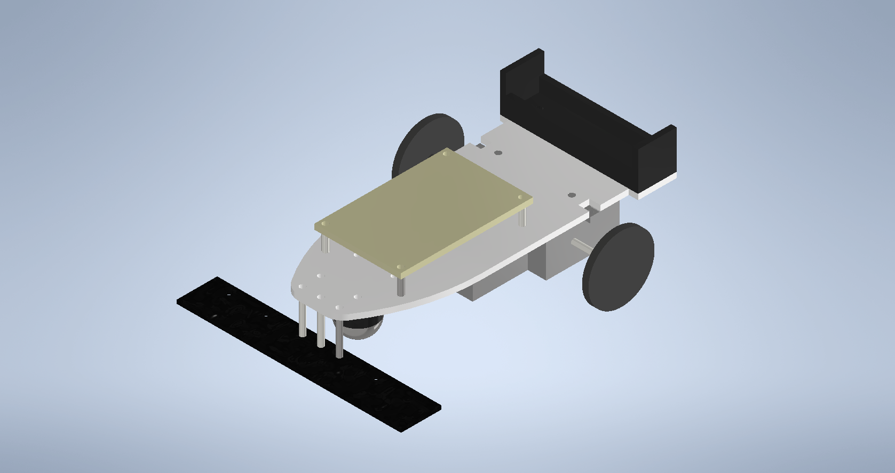
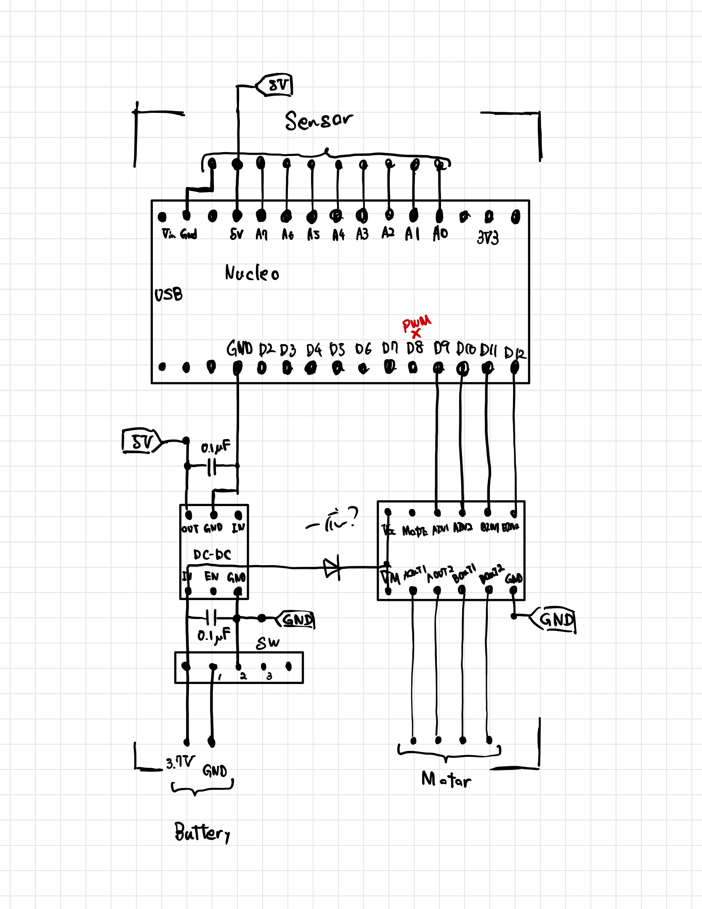

# サクッと作れるライントレースカーを作ろう

## 概要

タミヤ製品や秋月のキットのような既存製品を組み合わせて，できるだけサクッと作れるライントレースカーを製作してみました．得た知見などを初学者にも分かりやすいように書き残します．

キーワード
STM32 PID制御 Inventor

## 部品リスト

個数が明記されていないものは1個です．できるだけ秋月で取り扱いのあるもので選定しました．

### 回路要素

- [Nucleo STM32F303K8](https://akizukidenshi.com/catalog/g/gM-10172/)
    NucleoはSTM32っていうARM(スマホとか携帯ゲーム機とかのCPUを設計している会社)が設計しているCortexというアーキテクチャ(まぁ設計図くらいに思ってください)を採用したというマイコンに，USB通信のモジュールやら電源系のモジュールやらを組み合わせて一枚の基板にしたもの　的なやつ(っぽい)
    今回は8pinでガンガンAD(Analog-Digital)変換をするので高性能なマイコンの方がいいかな～&STM32を触ってみたかったのでこれを選定しましたが，Arduino Nanoとか(AVRとかPICとか)の安価なマイコンでも大丈夫な気もします．
- [ピンソケット 15P](https://akizukidenshi.com/catalog/g/gC-10102/) 2個
    Nucleoﾁｮｯﾄ高いので再利用することを視野に入れて一応．
- [ライントレース用センサ](https://akizukidenshi.com/catalog/g/gM-13416/)
    ちょい高い気もする&センサ多すぎる気もするけど楽なので...
    電源(5V)とGND，各センサのアウトプット×8で10ピンです．
- [フルブリッジDCモータドライバ](https://akizukidenshi.com/catalog/g/gK-09848/)
    これ一個でモータ二個回せるらしいです すご～い 電源電圧範囲が広いのも嬉しいですね
- コネクタ
    - [XHコネクタ 10P ハウジング](https://akizukidenshi.com/catalog/g/gC-12843/)
    - [XHコネクタ 10P ポスト サイド型](https://akizukidenshi.com/catalog/g/gC-13897/)
    - [XHコネクタ 4P ハウジング](https://akizukidenshi.com/catalog/g/gC-12257/)
    - [XHコネクタ 4P ポスト  サイド型](https://akizukidenshi.com/catalog/g/gC-12842/)
    - [XHコネクタ 2P ハウジング](https://akizukidenshi.com/catalog/g/gC-12255/)
    - [XHコネクタ 2P ポスト サイド型](https://akizukidenshi.com/catalog/g/gC-12262/)
    - [XHコネクタ コンタクト](https://akizukidenshi.com/catalog/g/gC-12265/)
      ※10個入*2～でもいいです 慣れてないと意外と失敗するので注意 10個入は[これ](https://akizukidenshi.com/catalog/g/gC-12264/)
- 電源
    - リチウムイオン電池 18650 3.7V
      なんかうちに転がってたのでこれにしました 別になんでもいいです．
      電圧5V以上のヤツ使う場合は昇圧DCDC→5V三端子レギュレータとかにするのと，モーターの定格が3Vなので(元々超えてるのは気の所為)なんかいい感じに考えてください()
    - [電池ボックス 18650](https://akizukidenshi.com/catalog/g/gP-08407/)
    - [5V昇圧DCDCコンバータ](https://akizukidenshi.com/catalog/g/gK-13065/)
      実は最大電流ちょっと怪しいかも
- [基板取付トグルスイッチ](https://akizukidenshi.com/catalog/g/gP-00300/)
  電源オフの度にバッテリー抜くならなくてもいいです
- パスコン 2つ
 適当なセラコン([こういうやつ](https://akizukidenshi.com/catalog/g/gP-10147/))を買ってください
- [72×47mm 片面ユニバーサル基板](https://akizukidenshi.com/catalog/g/gP-03229/)

### 機械要素

- タミヤ 楽しい工作シリーズ No.168 ダブルギヤボックス(左右独立４速タイプ，モーター付属) ([Amazon](https://www.amazon.co.jp/gp/product/B001Q13BIU/))
  マブチモータ FA130が2つ付属しています．
- タミヤ 楽しい工作シリーズ No.193 スリムタイヤセット(36・55mm径) ([Amazon](https://www.amazon.co.jp/gp/product/B003YORNNG/))
- タミヤ 楽しい工作シリーズ No.144 ボールキャスター 2セット入([Amazon](https://www.amazon.co.jp/gp/product/B001VZHRW2/))
- [スペーサー 10mm](https://akizukidenshi.com/catalog/g/gP-08164/) 4つ
- [スペーサー 20mm](https://akizukidenshi.com/catalog/g/gP-07321/) 3つ
- M3 ネジ 9個
- M3 ナット 9個
- 適当なアクリル板(70×140以上，厚さ3mm)
  私は大学でレーザー加工機を借りることができる環境でしたのでこうしましたが，借りることのできない場合，代替策を考えてください．

### コース

- ビニールテープ 幅19mm
- 適当な板

ビニールテープと板は白黒の組み合わせが良いと思います．

### 工具類

- はんだ付関連(はんだごて，はんだ，(フラックス，ハンダ吸い取り線or器))
- 圧着ペンチ(意外と高えので借りても良いかも)
- 線材
  でんきとおればなんでもいいです
  普通のビニル線(https://akizukidenshi.com/catalog/g/gP-06756/)
  10Pリボンケーブル(https://akizukidenshi.com/catalog/g/gC-06973/)
- レーザー加工機(大学で借りました)

部品点数減らしたつもりなんですが...
なんやかんや6000円くらいかかってしまいました．

## CADる

Inventorというか3DCAD使うのロ技CAD講習会以来2回目なのでカスポイントたくさんあると思うんですけど見逃してください><
やってる途中で欠陥ポイントに気づけたりする&紙でメモ取るよりスッキリするしかっこよくてモチベ上がるので結構いいかも知れないと思いました．
`Inventor`フォルダに全部入っています．
全体図

## 回路考える

Eagleとかいうやつを使うのがめんどくさかったのでGoodNotesで適当にゴミみたいなスケッチを描きました．
正直公開したくないんですが，まぁ公開します(?)
Eagleﾁｮﾁｮって使えるようになりたい

結構キツキツになるかと思ったんですけどパーツ数少ない&センサ外部にあるで意外と余裕のある感じになりました．
ダイオード入れたほうがいいのかもですけど面倒なので入れませんでした(笑)

## 組み立て！

とりあえず色々な部品を秋月・Amazonに発注かけてM3ネジ・ナットとアクリル板をホムセンか東急ハンズかなんかで入手します．
アクリル板を入手したらものつくりセンターのレーザー加工機を予約して(レーザー加工機を使うのが初めての場合は講習が必要になります)

↑レーザー加工機で切り出したアクリル板

タミヤのやつは...

- ダブルギアボックスは4種類のギア比が選べるのですがタイプBで組み立ててください
- タイヤは36mm(小さい方)を使います
- ボールキャスターは25mmで組み立ててください

↑できたやつ

メモを元にユニバーサル基板に適当にパーツをハンダ付けして...

↑はんだ付け後の基板

完成～！

## 環境構築

今回STM32を触るのが初めてなので，環境構築から始まります．
どうやら色々な方法で開発できるらしく(arduino環境やmbedとかも)，迷いました．
出来ればVScodeでやりたかったのでそうしようかと思ったのですが，~~めんどくさそう~~まぁ最初なのでとりあえずスタンダードっぽいSTMicroからリリースされているCubeIDEを使うこととしました．
CubeIDE DLページ : https://www.st.com/ja/development-tools/stm32cubeide.html

